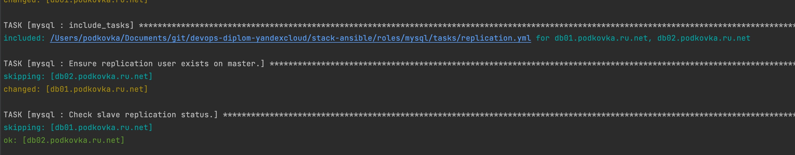
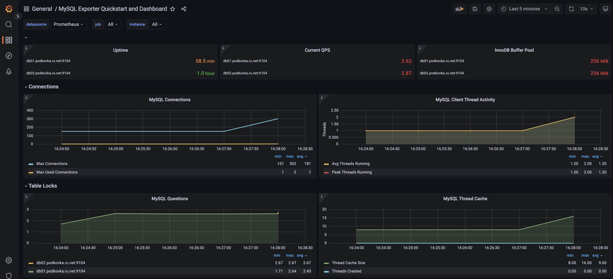

# Дипломный практикум в YandexCloud

### Регистрация доменного имени
Практически все действия выполняются [скриптом](init.sh) на локальной машине под управлением MacOS  

Зарегистрировано доменное имя `podkovka.ru.net`  
DNS управление передано в CloudFlare  
Добавил CloudFlare DNS на сетевые карты  
```
sudo networksetup -setdnsservers Wi-Fi 1.1.1.1  
sudo networksetup -setdnsservers USB\ 10/100/1000\ LAN 1.1.1.1
```
### Создание инфраструктуры
Экспорт секретов 
```
export YC_SERVICE_ACCOUNT_KEY_FILE="/Users/podkovka/.key.json"  
export YC_CLOUD_ID=...  
export YC_FOLDER_ID=... 
export YC_STORAGE_ACCESS_KEY=...  
export YC_STORAGE_SECRET_KEY=... 
export CLOUDFLARE_EMAIL=... 
export CLOUDFLARE_API_TOKEN=...
```  
*Файл /terraform/stage/meta.txt со следующим содержанием исключен из загрузки в репозитории:
```
#cloud-config
users:
  - name: podkovka
    groups: sudo
    shell: /bin/bash
    sudo: ['ALL=(ALL) NOPASSWD:ALL']
    ssh-authorized-keys:
      - ssh-rsa ...secret...
```
Инициируем S3  
```
cd terraform/s3_init/ 
terraform init&& terraform plan&& terraform apply -auto-approve
```
Разворачиваем инфраструктуру с workspace stage  
*private ip proxy server установлен статическим, иначе код создания сети уходил в loop
```
cd ../stage/  
terraform init -reconfigure -backend-config "access_key=$YC_STORAGE_ACCESS_KEY" -backend-config "secret_key=$YC_STORAGE_SECRET_KEY"
terraform workspace new stage  
terraform init&& terraform plan&& terraform apply -auto-approve
terraform output -json > output.json
```  

  

```
Apply complete! Resources: 18 added, 0 changed, 0 destroyed.
```  

  

6 VM на основе ubuntu-1804-lts и 1 VM (proxy) на основе nat-instance-ubuntu-1804-lts  
Заносим A записи в CloudFlare DNS  

  

Вывод манифестов terraform сохраняем в output.json
```
terraform output -json > output.json
```
Очищаем кэш DNS и проверяем доступность хоста  *MacOS
```
((count = 10))
while [[ $count -ne 0 ]] ; do
sh ../../flushcache.sh
ping -c 1 podkovka.ru.net
rc=$?
if [[ $rc -eq 0 ]] ; then
((count = 1))
else
sleep 5
fi
((count = count - 1))
done

if [[ $rc -eq 0 ]] ; then
echo "Host is available"
else
echo "For reset cache DNS enter command"
echo "sudo dscacheutil -flushcache; sudo killall -HUP mDNSResponder"; exit
fi
```
Записываем переменные
```
export vm_app_private=$(< output.json jq -r '.vm_app_private | .value')
export vm_db01_private=$(< output.json jq -r '.vm_db01_private | .value')
export vm_db02_private=$(< output.json jq -r '.vm_db02_private | .value')
export vm_gitlab_private=$(< output.json jq -r '.vm_gitlab_private | .value')
export vm_monitoring_private=$(< output.json jq -r '.vm_monitoring_private | .value')
export vm_proxy_private=$(< output.json jq -r '.vm_proxy_private | .value')
export vm_runner_private=$(< output.json jq -r '.vm_runner_private | .value')
```
На основе переменных, из файла [hosts.tmp](stack-ansible/hosts.tmp)  формируем hosts файл
```
cd ../../stack-ansible || return
envsubst < "hosts.tmp" > "hosts"
```
Запускам ansible-playbook
```
ansible-playbook playbook.yml -i hosts
```

---
### Установка Nginx и LetsEncrypt

Ролью [proxy_server](stack-ansible/roles/proxy_server) разворачиваем на основе `NGINX` `reverse proxy` и получаем `LetsEncrypt` сертификаты  
Переменные задаются в [/roles/proxy_server/defaults/main.yml](stack-ansible/roles/proxy_server/defaults/main.yml)  

  

___
### Установка кластера MySQL

Ролью [mysql](stack-ansible/roles/mysql) поднимаем кластер `MySQL master-slave replication`  
Переменные задаются в [/roles/mysql/defaults/main.yml](stack-ansible/roles/mysql/defaults/main.yml)  

  

___
### Установка WordPress  

Ролью [wordpress](stack-ansible/roles/wordpress) поднимаем `apache2`, `php-7.2` и `wordpress`, подключаемый к кластеру MySQL  
Переменные задаются в [/roles/wordpress/defaults/main.yml](stack-ansible/roles/wordpress/defaults/main.yml)  

  

---
### Установка Gitlab CE и Gitlab Runner

Поднимаем ролями [gitlab](stack-ansible/roles/gitlab) (*root/paSSw0rD53124) и [runner](stack-ansible/roles/runner) (*подключается автоматически, runners_registration_token задан в конфигурации).  
Переменные задаются в [/roles/gitlab/defaults/main.yml](stack-ansible/roles/gitlab/defaults/main.yml) и [/roles/runner/defaults/main.yml](stack-ansible/roles/runner/defaults/main.yml)  

  

  

Создадим .gitlab-ci.yml
```
---
before_script:
  - 'which ssh-agent || ( apt-get update -y && apt-get install openssh-client -y )'
  - eval $(ssh-agent -s)
  - echo "$ssh_key" | tr -d '\r' | ssh-add -
  - mkdir -p ~/.ssh
  - chmod 700 ~/.ssh

stages:
  - deploy

deploy-job:
  stage: deploy
  script:
    - echo "Deploying application..."
    - ssh -o StrictHostKeyChecking=no podkovka@app.podkovka.ru.net sudo chown podkovka /var/www/www.podkovka.ru.net/wordpress/ -R
    - rsync -rvz -e "ssh -o StrictHostKeyChecking=no" ./* podkovka@app.podkovka.ru.net:/var/www/www.podkovka.ru.net/wordpress/
    - ssh -o StrictHostKeyChecking=no podkovka@app.podkovka.ru.net rm -rf /var/www/www.podkovka.ru.net/wordpress/.git
    - ssh -o StrictHostKeyChecking=no podkovka@app.podkovka.ru.net sudo chown www-data /var/www/www.podkovka.ru.net/wordpress/ -R
```
Добавим ssh-key в Settings/CI/CD/Variables  

  

Заменим картинку на главной странице проекта  
При commit в проект запускается deploy-job и изменения выливаются на сервер  

  

  

  

___
### Установка Prometheus, Alert Manager, Node Exporter и Grafana

Ролями [prometheus](stack-ansible/roles/prometheus), [alertmanager](stack-ansible/roles/alertmanager), [node_exporter](stack-ansible/roles/alertmanager) и [grafana](stack-ansible/roles/grafana) (*admin/admin) поднимаем стек мониторинга  
Переменные и конфигурации задаются в [/roles/prometheus/templates/prometheus.yml](stack-ansible/roles/prometheus/templates/prometheus.yml), [/roles/alertmanager/templates/alerts.rules.yml](stack-ansible/roles/alertmanager/templates/alerts.rules.yml)  

  

  

  

Остановим VM runner. Получаем алерт о недоступном инстансе:  
В Prometheus пока в пендинге:  

  

В Alertmanager через 5 минут:  

  

Дописав конфигурацию Prometheus, можно отправить сообщения, например, на telegram-каналы (с версии 0.24 alertmanager поддерживает telegram "из коробки")  
Пример из рабочей конфигурации:  


Добавим на хосты с MySQL DB экспортер через роль [/roles/mysqld_exporter](stack-ansible/roles/mysqld_exporter)  
И добавим в Grafana MySQL dashboard через роль [/roles/grafana](stack-ansible/roles/grafana), дописав код добавления дашборды.  
`- name: Add mysqld_exporter dashboard`  

  

---
## Что необходимо для сдачи задания?

1. Репозиторий со всеми Terraform манифестами и готовность продемонстрировать создание всех ресурсов с нуля.
2. Репозиторий со всеми Ansible ролями и готовность продемонстрировать установку всех сервисов с нуля.
3. Скриншоты веб-интерфейсов всех сервисов работающих по HTTPS на вашем доменном имени.
- `https://www.podkovka.ru.net` (WordPress)
- `https://gitlab.podkovka.ru.net` (Gitlab)
- `https://grafana.podkovka.ru.net` (Grafana)
- `https://prometheus.podkovka.ru.net` (Prometheus)
- `https://alertmanager.podkovka.ru.net` (Alert Manager)
4. Все репозитории рекомендуется хранить на одном из ресурсов ([github.com](https://github.com) или [gitlab.com](https://gitlab.com)).
